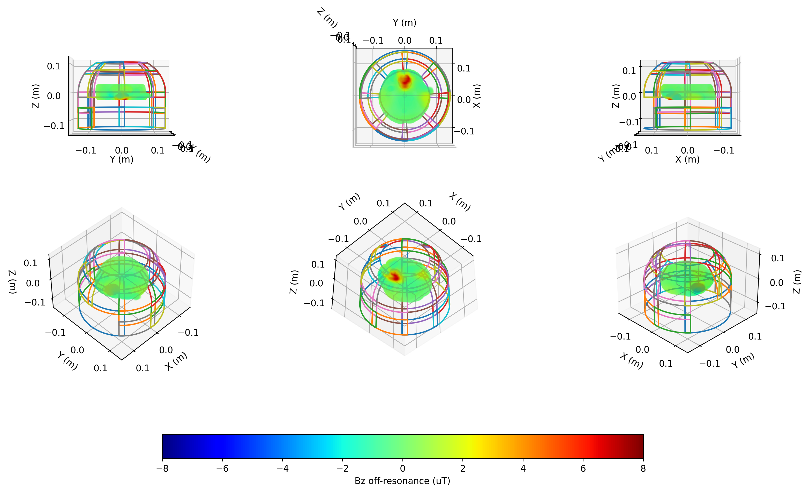
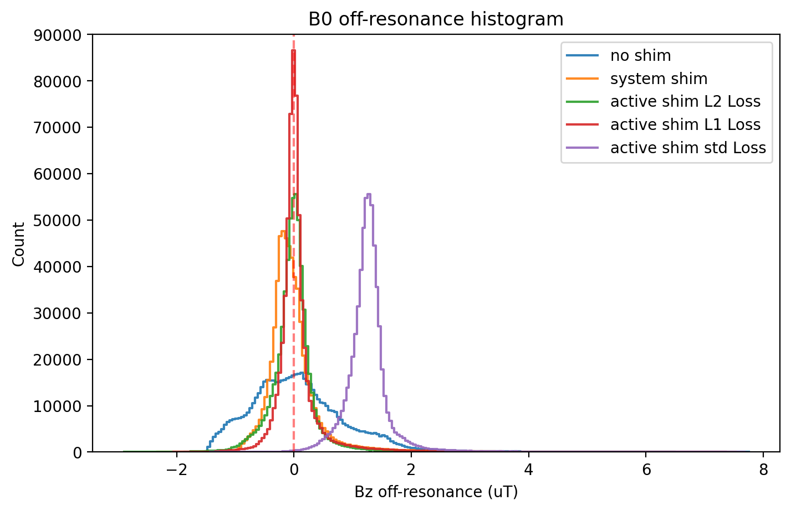

# Homework 2: Active Shimming

+ Author: Haotian Hong
+ Date: 2024-06-08
+ ID: 2023291007

## Requirements

Use a multi-coil model to shim the in vivo brain B0-offset map.

## Theory: Bio-Savart Law

The magnetic field $\vec{B}$ generated by $\vec{dl}$ of a current-carrying coil loop is given by 

$$\vec{B} =\int_{coil}\vec{dB}= \cfrac{\mu_0}{4\pi}\int_{coil}\cfrac{I\vec{dl}\times\vec{r}}{|\vec{r}|^2}$$

where $\vec{r}$ is the vector from the current element to the position of the field point, and $\vec{dl}$ is the current element.

Commonly we only consider the axial component of
B since the presence of the very large static magnetic field in z direction, meaning that the other components of B are negligible when evaluating the local larmor frequency.

## Methods and Materials

### Shimming Coils and Masked Brain data

The shimming coils data are loaded from the mat file 'coil_trace.mat', which contains the coil trace data of 29 coils with different shapes and sizes. The coil information was finally stored in a 29 size cell array, where each cell contains the coil trace data of a coil.

The masked brain data is derived from the homework 1, which contains the in vivo brain B0-offset map. To accelerate the computation, we only calculated the masked positions of the brain. The brain axis is aligned with the coil axis, with the brain center at the origin. The susceptibility of the brain was converted to the B0-offset ($\mu T$) by multiplying the susceptibility by the field strength (3T). The preprocessing of the masked brain data is done with python and saved as a mat file 'B0_map_prep.mat'.

The location of the coils and the masked brain data without shimming are shown in the following figure.



### Accelerated Bz calculation

The Bz field generated by the coils is calculated by the Biot-Savart law. However, the code provided in the homework is too slow to calculate the Bz field for all the coils, which is not practical for the optimization process. Therefore, we optimized the code by vectorizing the calculation and using parallel computing to accelerate the calculation. The optimized code is shown below.

```matlab
% Accelerated Bio-Savart Law to calculate the magnetic field
% (Modified from the original code provided by Zhihua Ren)
% Author: Haotian Hong
% Update: 6 june 2024
% Location: ShanghaiTech University

%% input
% X,Y,Z: the 3D grid points where the magnetic field is calculated
% coil_trace: the trace of all 15 coil
% currents: the current direction and amplitude parfor the coil array

%% output
% BZ: the magnetic field Bz generated by all current loops

function BZ = cal_Bz_Biotsavart_HHT(X,Y,Z,currents,coils)

num_coils = length(currents);
BZ = zeros(size(X,1), num_coils);

parfor i=1:num_coils
    current = currents(i);
    coil_trace = coils{i};
    BZ(:,i) = Bz_Biotsavart(X,Y,Z,current,coil_trace);
end
BZ = BZ*1e6; % convert to uT
end

function Bz = Bz_Biotsavart(X,Y,Z,current,coil_trace)
mu0=4*pi*1e-7;
x_P = coil_trace(1,:);
y_P = coil_trace(2,:);
z_P = coil_trace(3,:);
Bz = zeros(size(X,1),1);
parfor m=1:size(X,1)
    x_M = X(m);
    y_M = Y(m);
    z_M = Z(m);
    PkM3 = (sqrt((x_M-x_P).^2 + (y_M-y_P).^2 + (z_M-z_P).^2)).^3;
    DBz = ((x_P(2:end)-x_P(1:end-1)).*(y_M-y_P(1:end-1))-(y_P(2:end)-y_P(1:end-1)).*(x_M-x_P(1:end-1)))./PkM3(1:end-1);
    Bz(m) = mu0*current/4/pi*sum(DBz);
end
end
```

### Loss Function

Given that the bio-savart law is linear, the forward process can be expressed as a matrix multiplication. The Bz field generated by the coils can be calculated by the linear combination of the Bz field generated by each coil, with the current of the coils as the coefficients. The forward process is shown below.

$$B_{z,\text{coil}} = B_{\text{unit}}I_{\text{coils}}$$ 

where $B_{z,\text{coil}}$ is the Bz field generated by the coils, $B_{\text{unit}}$ is the Bz field generated by the unit current of the coils, and $I_{\text{coils}}$ is the current of the coils

The loss function is defined as the L2 norm of the sum of the B0-offset of the brain and the Bz field generated by the coils, as is shown below.

$$\text{loss} = \left\|B_{\text{brain}} + B_{z,\text{coil}}\right\|_2$$

where $B_{\text{brain}}$ is the B0-offset of the brain.

We've also experimented and compared between other loss functions, such as the L1 norm and the standard deviation of the B0-offset.

### Optimization Algorithm

Simulated annealing (SA) and particle swarm optimization (PSO) are explored to optimize the current of the coils. The SA algorithm is a probabilistic optimization algorithm inspired by the annealing process in metallurgy. The algorithm starts with a high temperature and gradually cools down to a low temperature. The algorithm accepts worse solutions with a certain probability at the beginning and gradually decreases the probability as the temperature decreases. The PSO algorithm is a population-based optimization algorithm inspired by the social behavior of birds flocking. The algorithm maintains a population of particles, each representing a potential solution to the optimization problem. The particles move in the search space and update their positions based on their own best position and the best position found by the swarm.

However, the SA algorithm is not suitable for the optimization problem since the algorithm is not able to converge to the optimal solution. The PSO algorithm is used to optimize the current of the coils. 

### Code Availability

The code is available at [https://github.com/bughht/MRI_System_Design](https://github.com/bughht/MRI_System_Design)

## Results

The current of the coils optimized by the PSO algorithm is shown in the following figure. 


The masked brain data after shimming is shown in the following figure. The severe field homogeneity around the nose and the eyes are relatively improved after shimming with the optimized current of the coils.


The histograms of the shimmed B0 field with loss function of  L2 norm, L1 norm and standard deviation together with the original field and the system shimmed field were depicted below.

It's apparent that the field homogeneity were significantly improved after shimming. The L1 norm loss function has the best performance in terms of the sharpness of the peak centered at the on-resonance frequency, which means the field offset is minimized. The L2 norm results shows a similar performance with the system shimmed field. Though the standard deviation loss function result has a sharper peak even outperform the L2 norm result, the peak is not located at the on-resonance frequency, which means a undesirable constant field offset is introduced.



The performance of the shimming is also evaluated with the criterias including the peak-to-peak field offset (pk-pk ppm), the root-mean-squared (RMS ppm) and standard deviation (std ppm) of the off-resonance map, and the efficacy of shimming $\epsilon = \frac{\sigma_{pre}-\sigma_{post}}{\sigma_{pre}}\times 100\%$ in the following table.

Based on the data presented, it can be concluded that the Active Shim L2 norm method provides the best performance in terms of shimming efficacy, with an efficacy of 48.371%. This surpasses the system shim, which has an efficacy of 35.300%, and significantly outperforms the Active Shim L1 norm, which shows an efficacy of 42.494%. 

The L1 norm loss function, while not as effective as the L2 norm, still shows an improvement over the system shim with an efficacy of 42.494%. However, it's worth noting that the L1 norm loss function provides the sharpest peak, indicating its potential usefulness in specific applications where peak sharpness is a priority.

The standard deviation loss function shows the least effective performance among all the loss functions, with a negative efficacy observed at -52.697%. This indicates that the shimming introduces an unfavorable offset.

|Shimming Method|pk-pk ppm|RMS ppm|std ppm|efficacy $\epsilon$|
|-|-|-|-|:-:|
|No Shim| 3.2061537476947892 | 229.59558193744226 | 0.2896884704533632 | - |
|System Shim| 3.2839351317270338 | 148.54703427693633 | 0.1885316695711095 | 35.30056936487095 %|
|Active Shim L2 norm| 3.1269753103179676 | 118.53783485154801 | 0.15044658850443954 | 48.371029681291546 %|
|Active Shim L1 norm| 3.1366500967868602 | 132.0308790424979 | 0.16581377477693687 | 42.494155188721244 %|
|Active Shim Std norm| 3.0384770204162077 | 350.586447579349 | 0.14351212576094124 | -52.69738407896413 %|

## Conclusion

In this homework, we've successfully implemented the active shimming of the in vivo brain B0-offset map using a multi-coil model. The PSO algorithm is used to optimize the current of the coils. The Active Shim with L2 norm loss function provides the best performance in terms of shimming efficacy, with an efficacy of 48.371%. The Active Shim L1 norm loss function, while not as effective as the L2 norm, still shows an improvement over the system shim with an efficacy of 42.494%. The standard deviation loss function shows the least effective performance among all the loss functions, with a negative efficacy observed at -52.697%.