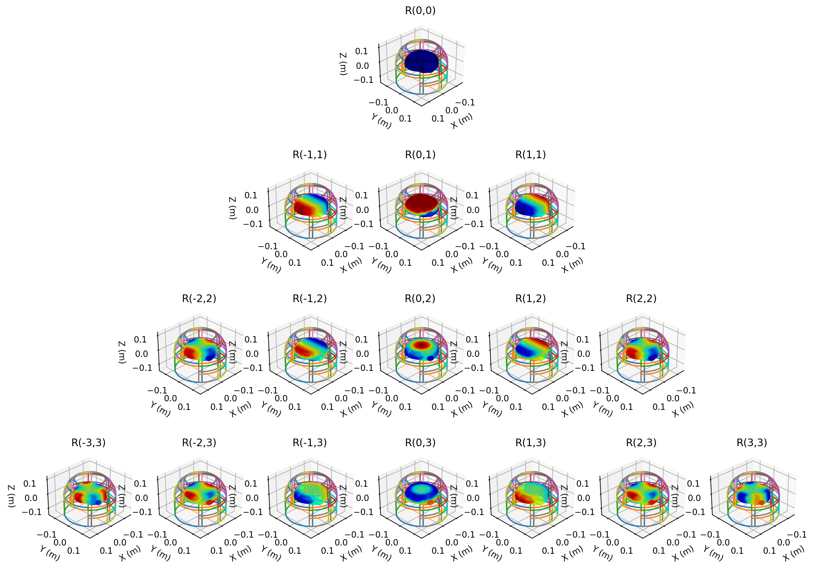
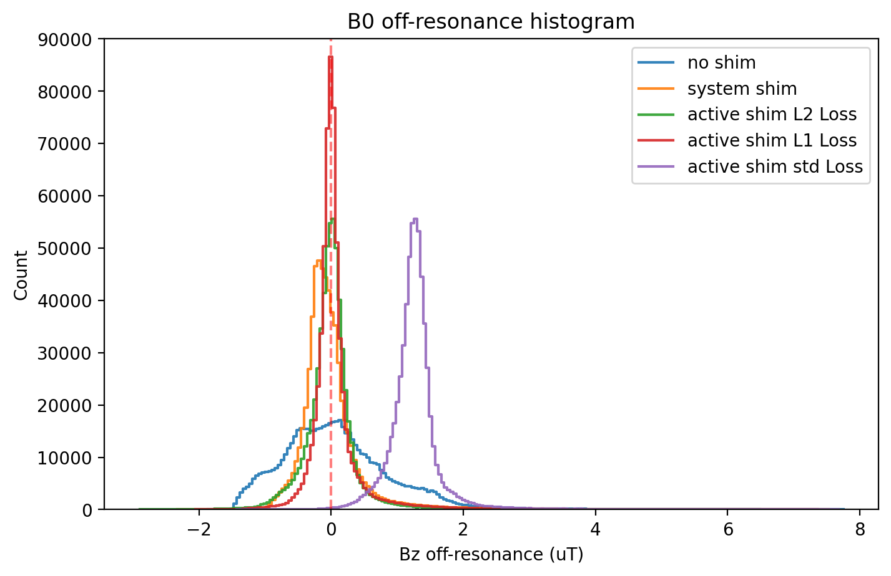

# Homework 3: Spherical Harmonics

+ Author: Haotian Hong
+ Date: 2024-06-09
+ ID: 2023291007

## Requirements

1. Analyze how many residual low order components left in three scenarios.
2. You may interpretate the data in two ways: histogram and Spherical Harmonic coefficients.
3. Submit a report with your results and data interpretation in form of pdf, and your code used to process the data.

## Theory: Spherical Harmonics

The spherical harmonics are the angular part of the solution to Laplace's equation in spherical coordinates. The spherical harmonics are a complete set of orthogonal functions on the sphere, and thus may be used to represent functions defined on the surface of a sphere, just as circular functions are used to represent functions on a circle through Fourier series.

$$R_n^m(r,\theta,\phi) = r^nP_n^m(\cos\theta)e^{jm\phi}$$

where $P_n^m$ are the associated Legendre polynomials, and $n$ and $m$ are integers that satisfy $0\leq m\leq n$. The spherical harmonics are orthonormal on the sphere, meaning that they are orthogonal with respect to the $L^2$ inner product on the sphere.

## Methods and Materials

### Data

The analysis is performed on the brain B0 map with and without system shimming. Homework 2 also produces the 29-ch multi-coil active shimming data with different loss functions (L1 norm, L2 norm, std). All the B0 maps are stored in .mat files and loaded into Python for analysis.

### Spherical Harmonic Expansion

The spherical harmonic Expansion is done utilized scipy library. Here we expand the first 3 order of spherical harmonics to the B0 map. The basis functions for the spherical harmonics shown below:

### Histogram Analysis

Although the histogram analysis has been done in the previous homework, we still present the histogram of the B0 map over here.

### Code Availability

The code is available at [https://github.com/bughht/MRI_System_Design](https://github.com/bughht/MRI_System_Design)

## Results

The spherical harmonic expansion of the B0 map with and without system shimming is shown in the bar plot and the table below. The x-axis represents the order of the spherical harmonics, and the y-axis represents the magnitude of the coefficients in the log scale. Here we can see that the B0 map without shim shows a relatively high magnitude for all orders of spherical harmonics. However, the B0 map with system shimming shows a significant reduction in zeroth order spherical harmonics, which indicates that the system shimming effectively removes the low-frequency components in the B0 map. With respect to the 29-channel active shimming, the L2 norm loss function shows the best performance in reducing the low order spherical harmonic components.

|Shimming Method|R(0,0)|R(-1,1)|R(0,1)|R(1,1)|R(-2,2)|R(-1,2)|R(0,2)|R(1,2)|R(2,2)|R(-3,3)|R(-2,3)|R(-1,3)|R(0,3)|R(1,3)|R(2,3)|
|---|---|---|---|---|---|---|---|---|---|---|---|---|---|---|---|
| No Shim | 16579.010 | 5090.957 | 885.143 | 5090.957 | 20.755 | 22.654 | 14.172 | 22.654 | 20.755 | 6.519 | 1.057 | 11.846 | 5.758 | 11.846 | 1.057 | 6.519 | 
| System Shim | 639.954 | 1158.936 | 222.990 | 1158.936 | 18.674 | 25.885 | 9.885 | 25.885 | 18.674 | 5.263 | 0.064 | 0.835 | 0.830 | 0.835 | 0.064 | 5.263 | 
| Active Shim L2 | 5231.879 | 127.979 | 39.833 | 127.979 | 4.609 | 18.505 | 1.307 | 18.505 | 4.609 | 1.325 | 0.706 | 1.932 | 0.661 | 1.932 | 0.706 | 1.325 | 
| Active Shim L1 | 11346.055 | 475.263 | 297.361 | 475.263 | 17.081 | 25.539 | 24.252 | 25.539 | 17.081 | 2.547 | 0.657 | 1.310 | 1.927 | 1.310 | 0.657 | 2.547 | 
| Active Shim Std | 133344.782 | 633.732 | 45.457 | 633.732 | 44.108 | 9.537 | 333.521 | 9.537 | 44.108 | 2.010 | 1.228 | 4.579 | 1.370 | 4.579 | 1.228 | 2.010 | 

The following histograms illustrate the shimmed B0 field using different loss functions: L2 norm, L1 norm, and standard deviation. These are compared with the original field and the system shimmed field.

The field homogeneity shows marked improvement post-shimming. The L1 norm loss function outperforms the others in terms of peak sharpness at the on-resonance frequency, indicating minimal field offset. The L2 norm results are comparable to the system shimmed field. While the standard deviation loss function result exhibits a sharper peak, surpassing the L2 norm result, it is not centered at the on-resonance frequency, suggesting the introduction of an unwanted constant field offset.

## Conclusion

In this homework, we've successfully analyzed the residual low-order components in the B0 map with and without system shimming. The spherical harmonic expansion shows that the system shimming effectively removes the low-frequency components in the B0 map. The 29-channel active shimming with the L2 norm loss function shows the best performance in reducing the low-order spherical harmonic components. The histogram analysis further confirms the effectiveness of the shimming methods, with the L1 norm loss function providing the sharpest peak at the on-resonance frequency. The L2 norm loss function shows comparable results to the system shimmed field, while the standard deviation loss function introduces an undesirable constant field offset.